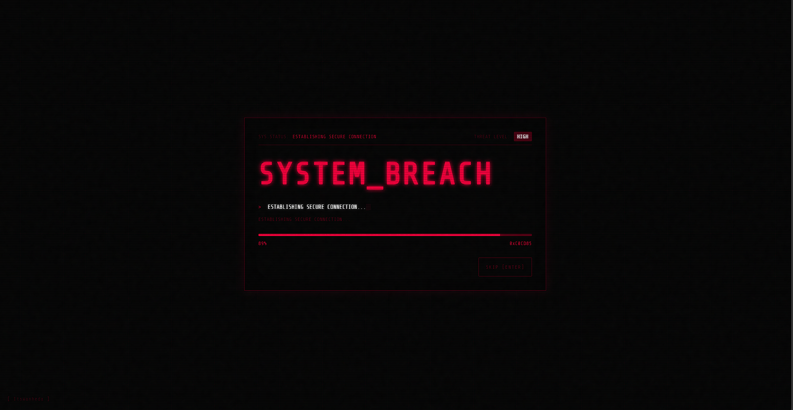

# Hacker-ish Style Preloader

> A high-end, cyberpunk-style preloader animation built with **HTML**, **CSS**, and **Vanilla JavaScript**.  
> Sleek, dark, aggressive, and designed to feel like a terminal from the future.

<p align="center">
  
  
  
  
</p>

<p align="center">
  
</p>



---

## ✨ Features

- **Cyber Aesthetic**  
  Strict black-and-red palette with CRT scanlines, noise, and gritty digital atmosphere.

- **Glitch Typography**  
  Advanced CSS glitch effects with chromatic aberration for a sharp hacker-style look.

- **Variable Loading Logic**  
  Simulates realistic latency with stalling, bursts, and unpredictable progress behavior.

- **Threat Level System**  
  Dynamic status indicators that evolve based on loading progress.

- **Interactive Controls**  
  Includes a **Skip** button plus keyboard shortcuts: `Enter` / `Esc`.

- **Auto Timeout**  
  Forces completion after 10 seconds to prevent infinite loading loops.

- **Responsive Design**  
  Fully functional across mobile and desktop devices.

---

## 🚀 Live Demo

[View the live demo here](#)

> Replace the link above with your GitHub Pages URL.

---

## 🛠️ Installation

### 1. Clone the repository
```bash
git clone https://github.com/YourUsername/preloader.git
```
### 2. Open the project
**Open index.html in your browser.**

---

## 📂 Project Structure
```text
preloader/
├── src/
│   ├── index.html
│   ├── img/
│   │   └── Preloader-Preview.png
│   ├── static/
│   │   └── main.js
│   └── styles/
│       └── styles.css
├── README.md
├── .gitignore
├── LICENSE
├── CONTRIBUTING.md
├── CODE_OF_CONDUCT.md
└── SECURITY.md
```

---

## 🤝 Contributing
*Contributions are welcome and appreciated.*
> If you’d like to improve the design, add effects, or optimize the logic, feel free to open a Pull Request.

---

## 📄 License
*This project is licensed under the MIT License.*

>See the LICENSE file for full details.

---

## 👤 Author

**ItsWanheda**
**GitHub: ItsWanheda**

---